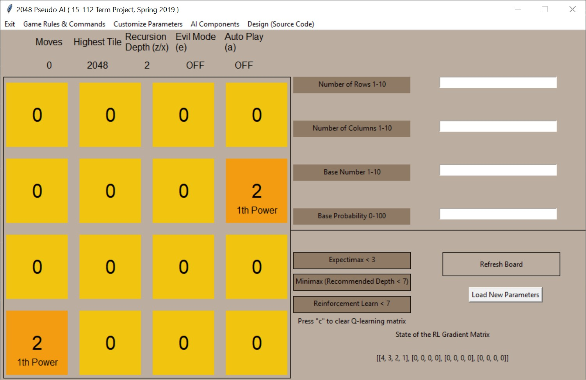

# 2048 Pseudo AI | 15-112 Term Project, Spring 2019
## Project Description
  The purpose of this project “2048 Pseudo-AI” is to create an open-sourced educational game of 2048 that introduces the concept of algorithmic AI relationship with customizable algorithmic parameters written in the Python language. By exploring the optimal strategies for solving the popular game 2048, this game will offer a complete, playable game, on top of which users are able to learn how the expectimax AI algorithm works and design their own parameters to alter the efficiency of the algorithm.

  Players will be given guidelines on how the top-down design of the AI algorithm is implemented, be able to alter the totally customizable parameters of each helper function of the algorithm, and finally, test the efficiency of their strategies by running the algorithm many times and obtain the probability of highest scores. At the later stages of the game, users may even be able to change the fundamental design of the game—for example, to have 3s and 5s, or to have multiple boards simultaneously—in order to learn the general purpose and mechanisms of this AI algorithm in solving complex problems.
## How to Run the Project
  Pretty much everything is prepared already. The user needs to simply run the __init__.py file in a code editor, and then a tkinter pop window should appear, from which the user should be able to follow the instructions to play the game.

  

### Major Dependencies: Python 3.6.6 (3 and above), Numpy (for infinity), matplotlib (for data visualization)
## Shortcut Commands: None.
*All necessary commmands willl be explained in the documentation within the game.
